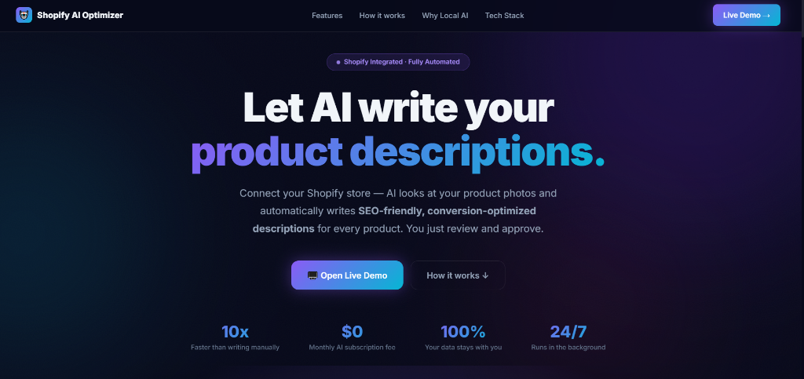
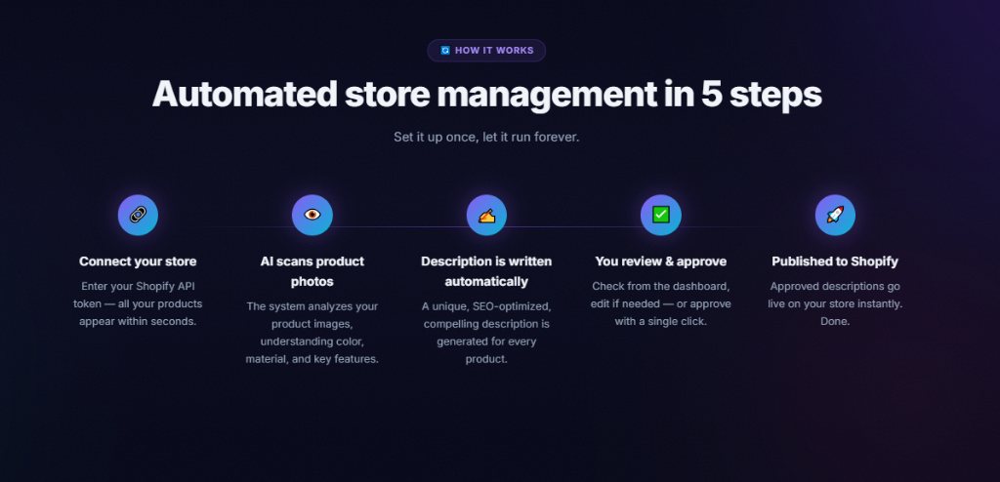
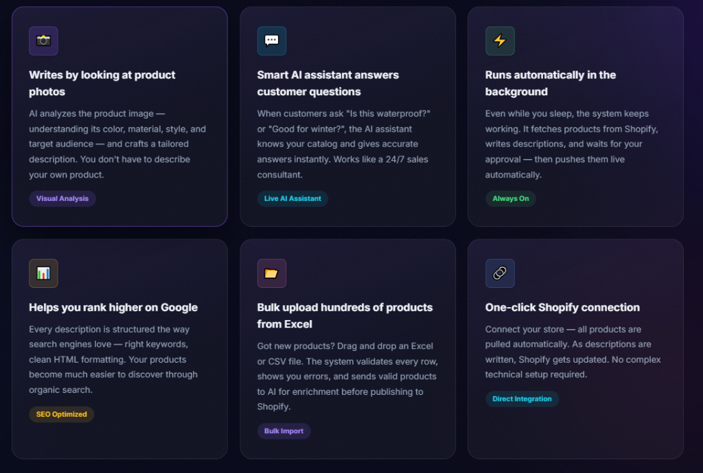
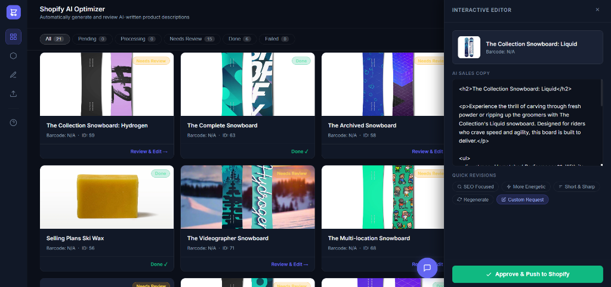

<div align="center">
  
# 🤖 Shopify AI Optimizer

**The $0/month Local AI Engine that writes your e-commerce product descriptions on autopilot.**

[](https://opensource.org/licenses/MIT)
[](https://fastapi.tiangolo.com)
[](https://shopify.com)

[Watch Video Demo](#) &middot; [API Documentation](http://localhost:8000/docs) &middot; [Report Bug](#)

<br/>



</div>

---

## 🎯 What is Shopify AI Optimizer?

Writing compelling product descriptions and managing massive catalogs is a time-consuming bottleneck for e-commerce businesses. 

**Shopify AI Optimizer** is a production-ready, local AI pipeline that connects directly to your Shopify Store, "looks" at your product photos, and generates high-converting, SEO-friendly HTML copy automatically. 

Built as a **comprehensive portfolio project**, this application demonstrates advanced software engineering, AI agent orchestration, and robust backend design. **And the best part? It runs 100% locally. Your data stays with you, and there are absolutely no monthly AI subscription fees.**

<div align="center">
  
</div>

---

## ✨ Enterprise-Grade Features

<div align="center">
  
</div>

- 🧠 **Custom ReAct Agent Architecture:** Implements a sophisticated autonomous AI agent capable of intelligent function calling (RAG integration, store manipulation) without the bloat of external frameworks like LangChain.
- 📸 **Multimodal Vision Engine:** Uses Vision LLMs (Llama 3.2 Vision) to visually process product images, extracting materials, colors, and stylistic nuances to inform the copywriting process.
- 💬 **Context-Aware AI Chat (RAG):** Features a built-in Hybrid RAG (Retrieval-Augmented Generation) chat assistant that acts as a personalized marketing consultant. It can instantly answer queries based on your catalog's specific data.
- 🚀 **Asynchronous & Resilient:** Engineered with robust Python `asyncio` background workers to handle long-running AI inference tasks and strict Shopify API rate limits invisibly, keeping the UI highly responsive.
- 📊 **Bulk Excel/CSV Pipeline:** A resilient drag-and-drop importer that handles bulk datasets, validates schema constraints (prices, barcodes), and queues them for AI enrichment.
- 🔒 **Data Privacy First:** Designed for local LLM inference via Ollama, ensuring zero data leakage to third-party APIs.

---

## ⚙️ How it Works in 5 Steps

<div align="center">
  
</div>

1. **Connect:** Securely enter your Shopify API token to instantly sync the catalog via REST API.
2. **Scan:** The system parallel-downloads and analyzes product images using local Multimodal Vision AI.
3. **Generate:** An asynchronous worker crafts a unique, SEO-optimized, and converting HTML description for every product.
4. **Approve:** Review the generated copy from the beautiful glassmorphism React-like vanilla frontend.
5. **Publish:** Push the approved updates back to the live Shopify store via POST/PUT requests with a single click.

---

## 🛠️ Technical Stack & Architecture

This architecture prioritizes raw performance, complete transparency, and developer control.

- **Backend / API:** Python, `FastAPI`, `Uvicorn`, `SQLAlchemy` (Async ORM)
- **Database / Vector Store:** `PostgreSQL` (with `pgvector` extension for semantic search)
- **AI Models & Inference:** Local inference via `Ollama` (Llama 3.2 Vision) and Gemini API function calling
- **Search & Retrieval:** Custom Hybrid RAG implementation (BM25 + Semantic Vector Search)
- **Frontend UI:** HTML5, Vanilla CSS (Modern Glassmorphism & CSS Grid), JavaScript
- **Background Jobs:** Async `asyncio` task polling queues, `httpx` for efficient I/O
- **Infrastructure:** Containerized with Docker & Docker Compose for guaranteed reproducibility

---

## 🚀 Getting Started (Local Development)

### 1. Prerequisites
- Docker & Docker Compose
- A Shopify Store (Custom App Access Token)
- [Ollama](https://ollama.com/) installed locally (if utilizing local models)

### 2. Environment Setup
Clone the repository and prepare your environment variables:
```bash
git clone https://github.com/yourusername/shopify-ai-optimizer.git
cd shopify-ai-optimizer
cp .env.example .env
```
*(Make sure to edit `.env` and add your `SHOPIFY_STORE_DOMAIN` and `SHOPIFY_ACCESS_TOKEN`)*

### 3. Launch the Stack
Start the Database, Backend API, and Background Workers automatically:
```bash
docker compose up --build -d
```

### 4. Experience the Magic
Navigate to `http://localhost:8000` in your browser. Watch the system ingest your products, analyze the visuals, and write beautiful marketing copy in real time.

<br/>

<div align="center">
  <i>Designed & Developed to Showcase Advanced AI Engineering</i>
</div>
